# Deliverable 1 — End-to-End Data Flow (Privacy-by-Design)

Project: Samsung PRISM — DPDP-compliant Consent Management + DSAR Platform
Status column legend: `BUILT` = works today · `PARTIAL` = exists but incomplete · `GAP` = must be built

---

## 0. Actors

| Actor | DPDP Act 2023 term | System identity |
|---|---|---|
| Photo subject / volunteer | **Data Principal** | `data_subjects.masterUserId` |
| Samsung R&D org | **Data Fiduciary** | — |
| face-worker / image-pii-worker | **Data Processor** | service accounts |
| DPO / Legal | Fiduciary's DPO (§10(2)(a)) | `AdminUser.role = dpo` |
| Data Owner | business owner of purpose | `AdminUser.role = dataOwner` |
| Collection Agent | field operator | `AdminUser.role = collectionAgent` |
| Data Team Admin | DSAR executor | `AdminUser.role = dataAdmin` |
| Platform root | break-glass | `AdminUser.role = super_admin` |

---

## 1. Master flow — photo origin to final resting place

```mermaid
flowchart TD
  subgraph GOV["Phase A — Governance (pre-collection)"]
    A1["Data Owner drafts Project<br/>purpose, data needs, retention"] -->|SUBMITTED| A2["DPO reviews<br/>purpose limitation §6"]
    A2 -->|APPROVED + ConsentTemplate bound| A3["Project.status = APPROVED<br/>policyVersion frozen"]
    A2 -->|REJECTED w/ reason| A1
    A3 --> A4["Data Owner creates ProjectAssignment<br/>→ Collection Agent"]
  end

  subgraph COL["Phase B — Collection (field)"]
    A4 --> B1["Agent opens Session<br/>status=ACTIVE, scoped to assigned project"]
    B1 --> B2["SessionInvite token → QR"]
    B2 --> B3["Data Principal scans, OTP auth<br/>reads Notice §5 in own language"]
    B3 --> B4["Signs consent → ProjectConsent<br/>consentId, signatureHash, policyVersion"]
    B4 --> B5["5-pose face enrollment<br/>embedding AES-256-GCM at rest"]
    B5 --> B6["Agent captures photos<br/>Photo.storagePath (ENCRYPTED envelope)"]
  end

  subgraph PROC["Phase C — Processing (automated, no human eyes)"]
    B6 --> C1["RecognitionJob QUEUED<br/>face detect + embed in RAM only"]
    C1 --> C2["In-session clustering<br/>FaceCluster + matchScore"]
    C2 --> C3["Agent tags clusters → subject<br/>(only stage a human sees raw frames)"]
    C3 --> C4["finalizeSession()<br/>re-check consent, drop revoked"]
  end

  subgraph MAP["Phase D — Consent mapping + redaction"]
    C4 --> D1["TX: photo_subjects rows<br/>photoId + subjectId + consentId"]
    D1 --> D2["TX: session_handoffs PENDING_INGEST"]
    D2 --> D3["TX: Session ARCHIVED"]
    D3 --> D4["Post-commit: face-worker /redact<br/>bystander blur"]
    D4 --> D5["image-pii-worker :8002<br/>OCR + Presidio Indian PII mask"]
    D5 --> D6["Photo.redactedPath written<br/>original NEVER overwritten"]
    D6 --> D7["destroyGallery() — session vectors purged"]
  end

  subgraph VAULT["Phase E — Ingest to golden store"]
    D7 --> E1["Data Team Admin reviews handoff"]
    E1 --> E2["POST /handoffs/:id/ingest"]
    E2 --> E3["Vault write: golden copy<br/>envelope-encrypted, retention clock starts"]
    E3 --> E4["Derived: DatasetExport / Analytics<br/>redacted derivative ONLY"]
    E4 --> E5["Search index (rebuildable)"]
  end

  subgraph DSAR["Phase F — Rights (§11 §12 §13)"]
    F1["Data Principal raises DSAR"] --> F2["DPO triage, SLA clock"]
    F2 --> F3["Data Owner: discovery evidence"]
    F3 --> F4["Data Admin: EXPORT or PURGE"]
    F4 --> F5["Deletion certificate + audit segment"]
    F5 --> F6["DPO approves, notifies via secure inbox"]
  end

  E5 -.lineage walked by.-> F3
  D1 -.consentId is the erasure key.-> F4
```



---

## 2. Photo lifecycle — every physical location it can exist

| # | Location | Path | Encrypted? | Who can read | Retention | Status |
|---|---|---|---|---|---|---|
| L1 | Agent device buffer | client RAM | TLS 1.3 in transit | agent | until upload ACK | BUILT |
| L2 | Original capture | `sessions/<sid>/photos/<pid>.jpg` | **GAP → must be AES-256-GCM envelope** | nobody after ARCHIVE (system only) | until session ARCHIVED + 7d | PARTIAL |
| L3 | Face crop | `sessions/<sid>/faces/<fid>.jpg` | GAP | agent during TAGGING only | destroyed at finalize | BUILT (unencrypted) |
| L4 | Enrollment selfie | `subjects/<uid>/enroll/<pose>.jpg` | GAP (blob) — embedding IS encrypted | agent at enroll, subject always | until consent PURGED | PARTIAL |
| L5 | Face embedding | DB `SubjectFaceEnrollment.embedding` | **AES-256-GCM, `nonce(12)||tag(16)||ct`** | matcher process only | with L4 | BUILT |
| L6 | Bystander/PII-redacted derivative | `sessions/<sid>/redacted/<pid>.jpg` | GAP | dataOwner, dataAdmin | project retention | BUILT |
| L7 | Per-person derivative | `sessions/<sid>/redacted/<pid>.person-<uid>.jpg` | GAP | that subject + agent | cache, TTL | BUILT |
| L8 | Vault golden copy | `vault/<projectId>/<pid>.enc` | GAP → envelope + separate KEK | nobody directly; export path only | project retention (default 7y) | GAP |
| L9 | Dataset export bundle | `exports/<jobId>.zip` | GAP → per-export DEK | requester, time-boxed URL | 7d then hard delete | GAP |
| L10 | DSAR access package | `dsar/<requestId>/package.zip` | GAP → subject-key wrapped | that Data Principal only | 30d | GAP |
| L11 | Backups | pg_dump / filesystem snapshot | GAP | ops break-glass | 35d | GAP |

**Rule:** every filesystem write goes through `backend/src/lib/storage.js`. That is the single choke point where envelope encryption gets added — no caller touches `fs` directly. This is already true today, so the change is one file.

---

## 3. Encryption architecture

### 3.1 In transit
| Hop | Today | Target |
|---|---|---|
| Browser/agent → backend | HTTP dev / TLS prod | TLS 1.3, HSTS, secure+httpOnly+sameSite cookies (`lib/cookies.js` already sets these) |
| backend → face-worker :8001 | plain HTTP localhost | mTLS or unix socket + shared-secret header |
| backend → image-pii-worker :8002 | plain HTTP localhost | same |
| backend → Postgres | plain | `sslmode=require` |
| backend → Redis | plain | TLS + AUTH (note: local Redis 5.0.14 is below BullMQ's 6.2 floor — must upgrade) |

### 3.2 At rest — envelope scheme (target)

```
MASTER KEK  (env: MEDIA_KEK  — 32B, rotated quarterly, never in git)
   │
   ├─ derive per-project DEK   HKDF-SHA256(KEK, salt=projectId, info="media-v1")
   │      └─ encrypts L2, L6, L7, L8 blobs   AES-256-GCM
   │
   ├─ derive per-subject DEK   HKDF-SHA256(KEK, salt=masterUserId, info="biometric-v1")
   │      └─ encrypts L4, L5   ← already implemented for L5 in lib/embeddingCrypto.js
   │
   └─ derive per-export DEK    random 32B, wrapped with KEK, stored on job row
          └─ encrypts L9, L10; destroying the wrapped key = crypto-shredding
```

Blob header format (mirror the embedding format so one primitive serves both):
`magic(4) || version(1) || keyId(8) || nonce(12) || tag(16) || ciphertext`

**Crypto-shredding is the DPDP erasure accelerator:** destroy the per-subject DEK and every L4/L5 artifact for that principal is unrecoverable in O(1), even in backups (L11) that cannot be rewritten. Blob deletion still runs for L2/L6/L7 because those are project-keyed, not subject-keyed.

### 3.3 Hashing / integrity
- `Photo.sha256` — dedupe + tamper evidence, unique per `[sessionId, sha256]`.
- `ProjectConsent.signatureHash` — proof of consent artifact.
- `AuditLog.payloadHash = HMAC-SHA256(AUDIT_HMAC_SECRET, canonical(entry) )`, `prevHash` chains.
  **Known limitation:** the chain is per `(entityType, entityId)`, not global, and payload plaintext is never stored. Good for tamper-evidence, useless as evidence of *what* happened. DSAR certificates therefore need their own signed record table (see §6).

---

## 4. Role visibility at each stage — what each tier sees and what is deliberately withheld

`○` = no access · `◐` = metadata/aggregate only · `●` = full · `▲` = access allowed but audited + justification required (break-glass)

| Stage / artifact | Subject | DPO | Data Owner | Collection Agent | Data Team Admin | super_admin |
|---|---|---|---|---|---|---|
| Project purpose + retention | ● (own consents) | ● | ● own | ◐ assigned only | ◐ | ● |
| Consent template text | ● | ● author | ◐ read | ◐ read | ○ | ● |
| Subject PII (name, phone, email) | ● own | ○ **withheld** | ○ **withheld** | ● assigned session only | ▲ during DSAR only | ▲ |
| Enrollment selfie (L4) | ● own | ○ | ○ | ● at enroll, then ○ | ▲ DSAR only | ▲ |
| Face embedding (L5) | ○ (never exposed) | ○ | ○ | ○ | ○ | ○ — **no human path exists** |
| Raw original photo (L2) | ● own photos | ○ | ○ | ● until session ARCHIVED | ▲ DSAR erasure only | ▲ |
| Face crops during tagging (L3) | ○ | ○ | ○ | ● TAGGING window only | ○ | ▲ |
| Redacted derivative (L6) | ● own | ◐ sample for audit | ● | ● | ● | ● |
| photo↔consent link | ● own | ◐ counts | ◐ counts | ○ | ● (lineage) | ● |
| Handoff batch | ○ | ◐ counts | ◐ counts | ○ | ● | ● |
| Vault golden copy (L8) | ○ | ○ | ○ | ○ | ○ — export API only | ▲ |
| Audit log | ● own entries | ● all (read) | ◐ own projects | ○ | ● all (read) | ● |
| DSAR request content | ● own | ● | ◐ discovery scope only | ○ | ● | ● |
| Deletion certificate | ● own | ● | ◐ | ○ | ● issue | ● |

**Deliberate withholding, and why:**
1. **DPO never sees subject identity or raw media.** DPO governs *process*. Giving legal the faces would make the reviewer a processor of biometric data with no purpose basis. DPO screens show pseudonymised subject refs (`SUB-a41f…`).
2. **Data Owner never sees raw originals.** Owner's purpose is the dataset, and the dataset is the redacted derivative. Requesting an original requires a justified break-glass with DPO co-sign.
3. **Collection Agent loses access the moment the session archives.** Agent's basis is operational necessity during capture; it expires. Enforced by `session.status = ARCHIVED` gating the read route, not by UI hiding.
4. **Nobody, at any tier, can read a face embedding.** There is no decrypt-to-response path. Embeddings are read only by the matcher inside a request lifecycle and zeroed after.
5. **Data Team Admin gets raw media only inside a DSAR.** Access is bound to `dsarRequestId`, expires with the request, and writes an `AccessEvent` per object touched.

---

## 5. Access logging — who accessed what, when

New table `AccessEvent` (GAP). Distinct from `AuditLog`: audit records *mutations*, access records *reads*. DPDP §8(4)/(5) reasonable-security obligation needs both.

```
AccessEvent {
  id, actorType (ADMIN|SUBJECT|SERVICE), actorId,
  objectType (PHOTO|ENROLLMENT|EXPORT|SUBJECT_PII|EMBEDDING),
  objectId, action (VIEW|DOWNLOAD|DECRYPT|EXPORT),
  purpose, dsarRequestId?, projectId?,
  ip, userAgent, breakGlass Boolean, justification String?,
  createdAt
}
```
Written by one middleware wrapper on every media-serving route, not per-handler. Retained 3y. Immutable via RLS `GRANT INSERT` only.

---

## 6. Retention, deletion, and the erasure walk

### 6.1 Retention clocks
| Data | Clock starts | Default | Enforced by |
|---|---|---|---|
| L2 original | session ARCHIVED | 7 days → then hard delete | `RetentionSweep` cron |
| L3 face crops | finalize | immediate (`destroyGallery`) | BUILT |
| L6 redacted | ingest | `Project.retention` (default 7y) | cron |
| L4/L5 biometrics | consent ACTIVE | until REVOKED, then 24h | revocation worker |
| L9/L10 exports | job done | 7d / 30d | cron |
| AuditLog | write | 7y, append-only | RLS |
| AccessEvent | write | 3y | cron |

### 6.2 The erasure walk (DPDP §12(3) + §8(7))

```
Subject(masterUserId)
 ├─ ProjectConsent[]           status → PURGED (row kept: proof consent existed)
 │   └─ PhotoSubject[]  @@index(consentId)   ← the erasure key
 │        └─ Photo
 │             ├─ storagePath (L2)      hard delete blob
 │             ├─ redactedPath (L6)     ── see multi-subject rule below
 │             └─ FaceDetection[]       cascade rows + delete cropPath (L3)
 ├─ SubjectFaceEnrollment[]    delete blob (L4) + destroy per-subject DEK (L5)
 ├─ SessionParticipant[]       cascade
 ├─ RefreshToken/OtpCode       cascade (already deliberate in schema)
 ├─ Vault objects (L8)         orchestrated delete + tombstone
 ├─ Export bundles (L9/L10)    crypto-shred wrapped DEK
 └─ Backups (L11)              cannot rewrite → covered by crypto-shred + documented residual
```

**Multi-subject rule (mandatory, currently unenforced):** a photo containing subjects A and B, where A erases, must **not** be deleted. Correct action:
1. delete `PhotoSubject(A, photo)` row,
2. delete A's `FaceDetection` rows + crops,
3. **re-run redaction** so A becomes a permanent bystander blur in L6,
4. delete L2 original if *any* subject on it has erased (originals are unredactable evidence).

Erasure is per-link, never per-photo. Anything that does `photo.delete()` on a subject request is a correctness bug that destroys B's lawfully-held data.

**Soft delete is banned on the erasure path.** `deletedAt` exists on enrollments for operational undo *before* archive only. A DSAR purge issues real `DELETE` + real `fs.rm` + real DEK destruction. SLA: **30 days statutory, 7 days internal target**, tracked on `DsarRequest.slaDueAt`.

### 6.3 Consent withdrawal ≠ DSAR erasure
Withdrawal (§6(4)) stops *future* processing and triggers erasure of what is not otherwise legally required. Implemented already at two gates: `lib/consent.js` at intake, and the re-check in `finalizeSession()` that drops links + deletes faces for anyone who revoked mid-session. Keep both.

---

## 7. Failure and rollback paths

| Failure | Detection | Rollback | Principal impact |
|---|---|---|---|
| Upload aborts mid-stream | sha256 mismatch vs client-declared | blob discarded, no `Photo` row (write row only after hash verify) | retry, nothing orphaned |
| Duplicate upload | `@@unique([sessionId, sha256])` | 409, existing row returned | idempotent |
| face-worker down | connect refuse / timeout | `RecognitionJob → FAILED`, session stays TAGGING, retry with backoff | session not finalizable — correct, blocks unmapped data |
| image-pii-worker down | timeout | **non-fatal today**: faces still blurred, PII text NOT masked | **must change to fatal**: mark `Photo.piiStatus = DEFERRED`, block ingest, retry queue. Shipping an unmasked Aadhaar is a DPDP breach |
| finalize TX fails midway | Postgres rollback | no `photo_subjects`, no handoff, session stays TAGGING | re-runnable, upsert on handoff makes it idempotent |
| Redaction fails post-commit | exception after TX | session IS archived, `redactedPath` null → serving route returns 409 not the original | fail-closed: never fall back to raw |
| Ingest fails | handoff stays PENDING_INGEST | idempotent retry | nothing half-ingested |
| Purge partially completes | per-location status rows on `PurgeJob` | resume from last completed location; certificate only issues at 100% | SLA clock keeps running, DPO sees it stalled |
| Unauthorized access attempt | `requireRole` 403 | request rejected | `AccessEvent(action=DENIED)` + rate-limit + alert DPO after N in window |
| Admin credential compromise | lockout fields on `AdminUser` | disable account, revoke refresh-token family (`lib/tokens.js` families already support this) | forced re-auth |
| Key compromise | — | rotate KEK, re-wrap DEKs (lazy re-encrypt on read), `keyId` in blob header makes it non-breaking | none |
| Breach affecting principals | — | DPDP: notify **Data Protection Board + each affected Principal without delay**; `BreachRecord` table + notification job | mandatory |

---

## 8. DPDP Act 2023 compliance map

| Section | Requirement | Where satisfied |
|---|---|---|
| §4 | Lawful basis only | `project_consent_matrix` sole authority; intake booleans explicitly non-authoritative (schema comment) |
| §5 | Itemised notice, plain language, multilingual | ConsentTemplate rendered pre-signature in join flow — **template model is a GAP** |
| §6(1) | Free, specific, informed, unconditional, unambiguous | one consent per project, all-or-nothing, `signatureHash` |
| §6(4) | Withdrawal as easy as giving | subject portal revoke → `lib/revocation.js` |
| §6(6) | Consent Manager registration | out of scope (first-party fiduciary) |
| §7 | Legitimate uses | none claimed — consent-only posture. Simplest defensible stance |
| §8(3) | Accuracy | subject can correct profile; correction DSAR type |
| §8(4) | Reasonable security safeguards | encryption at rest + transit, RBAC, RLS, audit chain |
| §8(5) | Breach notification | `BreachRecord` + DPB notification job — GAP |
| §8(7) | Erase on withdrawal / purpose end | revocation worker + `RetentionSweep` |
| §8(8) | Publish DPO contact | footer + notice |
| §9 | Children — no tracking/targeted ads, verifiable parental consent | `Subject.dateOfBirth` + guardian flow — GAP. Volunteers may be minors; must gate |
| §10 | Significant Data Fiduciary: DPIA, audit, DPO in India | DPIA doc + annual audit hooks |
| §11 | Right to access summary of data + processing | DSAR type ACCESS |
| §12 | Right to correction / erasure | DSAR types CORRECT / ERASE |
| §13 | Grievance redressal | DSAR type GRIEVANCE, SLA-tracked, DPO owns |
| §14 | Right to nominate | `Subject.nomineeContact` — GAP |
| Rules 2025 | 72h DPB breach report, retention limits | cron + `BreachRecord` |

---

## 9. Current implementation vs. target — honest gap list

**BUILT and real (no mocks):** admin auth + invite/reset, subject OTP auth, refresh-token families, project assignment scoping, session lifecycle, QR invite tokens, consent capture, 5-pose enrollment, encrypted embeddings, recognition queue, clustering + auto-tag with matchScore, finalize with consent re-check, bystander blur, Presidio Indian-PII masking service, handoff emit/list/ingest, lineage query, hash-chained audit.

**GAP:**
1. Project creation + DPO approval API — projects exist only via `prisma/seed-project.js`.
2. ConsentTemplate model + versioning + notice rendering.
3. Agent assignment API (currently the seed script).
4. Whole DSAR subsystem: request, SLA, discovery, evidence, purge/export executor, certificate.
5. `AccessEvent` read logging.
6. Media encryption at rest (L2/L4/L6/L7/L8).
7. Retention sweeper.
8. Multi-subject-safe erasure.
9. PII-worker failure is non-fatal — must fail closed.
10. All `dpo`/`dataOwner`/`dataAdmin` portal screens read `admin-portal/src/data/*.js` hardcoded arrays. Must be deleted, not adapted.
11. `roles.js` `stats`/`queue` are hardcoded strings — must become API-fed.
12. Redis 5.0.14 < BullMQ 6.2 floor.
